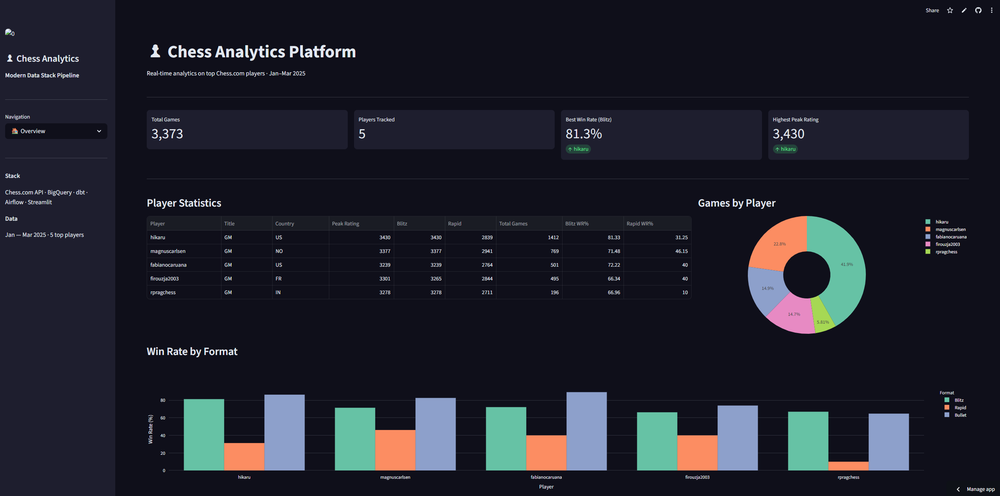
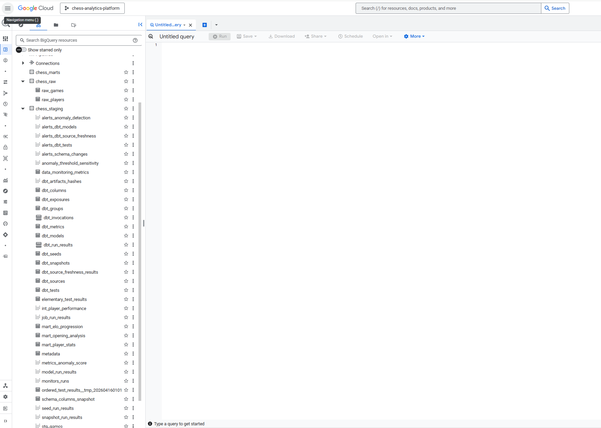
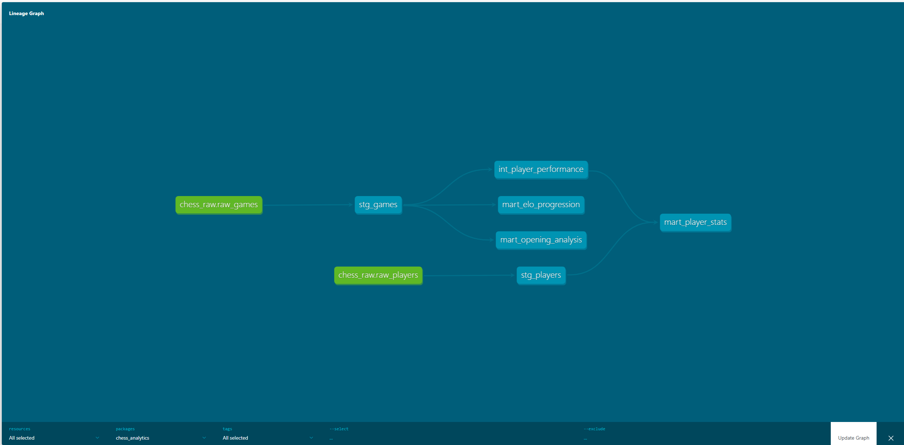
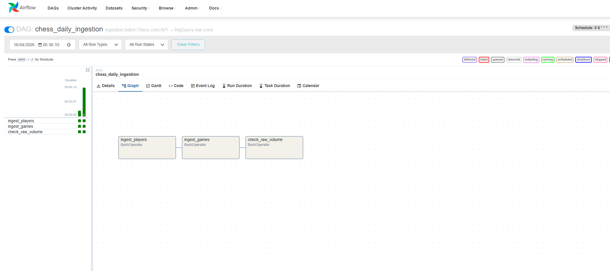
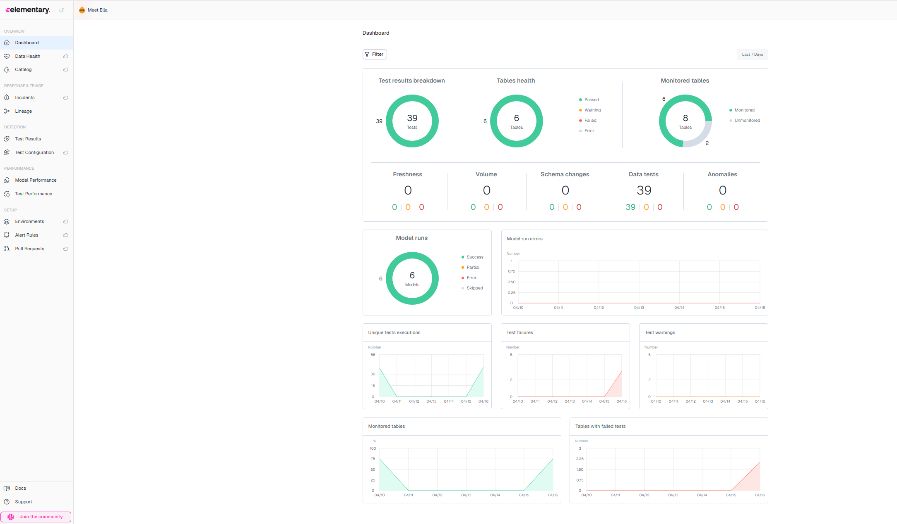

# ♟ Chess Analytics Platform

> End-to-end Modern Data Stack pipeline built on real Chess.com data — ingestion, transformation, orchestration, data quality, and a live dashboard.

🔗 **Live Dashboard** : [chess-analytics-platform.streamlit.app](https://chess-analytics-platform-ad9rpmjfvhqwmfmkejosxs.streamlit.app/)

## Dashboard

## Overview

This project implements a production-grade analytics engineering pipeline on top of the Chess.com Public API — no API key required. It tracks 5 top players (Magnus Carlsen, Hikaru Nakamura, Fabiano Caruana, Alireza Firouzja, Praggnanandhaa) across 3 months of games (Jan–Mar 2025).

The pipeline covers every layer of the Modern Data Stack:
- **Ingestion** — Python scripts pulling from Chess.com PubAPI into BigQuery raw zone
- **Transformation** — dbt Core with Medallion architecture (Sources → Staging → Intermediate → Marts)
- **Orchestration** — Apache Airflow DAGs scheduling ingestion and dbt runs
- **Data Quality** — dbt tests (41 passing), Elementary Data observability, Great Expectations validation
- **Serving** — Streamlit dashboard deployed publicly on Streamlit Cloud

**Data** : 3,421 games · 5 players · Jan–Mar 2025 · Chess.com PubAPI (free, no auth required)

## Stack

| Layer | Tool | Purpose |
|---|---|---|
| Source | Chess.com PubAPI | Player profiles, game archives, ratings |
| Storage | Google BigQuery | Cloud data warehouse · 3 datasets |
| Ingestion | Python · requests | Batch ELT scripts → BigQuery raw zone |
| Transformation | dbt Core | Staging → Intermediate → Marts · 6 models |
| Orchestration | Apache Airflow | DAG scheduling · Docker Compose |
| Data Quality | dbt tests · Elementary · Great Expectations | 41 tests · anomaly detection · validation suites |
| Serving | Streamlit · Plotly | Interactive dashboard · deployed on Streamlit Cloud |

## Architecture

The pipeline follows an ELT pattern — data is loaded first into BigQuery raw zone, then transformed in place using dbt.

    Chess.com PubAPI
         │
         ├── Batch (Python) ──────────────► BigQuery RAW
         │    └── fetch_games.py                │
         │    └── fetch_players.py              │
         │                                 dbt Core
         │                          (Staging → Intermediate → Marts)
         │                                      │
         │                          ┌───────────┴───────────┐
         │                          │                       │
         │                     Streamlit               dbt docs
         │                     Dashboard               Catalogue
         │
         └── Orchestration (Airflow)
              └── chess_daily_ingestion DAG
              └── chess_dbt_pipeline DAG
              └── chess_data_quality DAG

### BigQuery Datasets

## Data Modeling

The transformation layer follows the Medallion architecture with dbt Core on BigQuery.

### dbt Lineage Graph

### Models

| Model | Layer | Description |
|---|---|---|
| `stg_games` | Staging | Cleaned, typed game records · deduplication via ROW_NUMBER |
| `stg_players` | Staging | Player profiles and ELO ratings |
| `int_player_performance` | Intermediate | Win rates, ratings, performance by color and format |
| `mart_player_stats` | Mart | Final player analytics · all formats combined |
| `mart_opening_analysis` | Mart | Opening repertoire · win rates by ECO code |
| `mart_elo_progression` | Mart | Daily ELO tracking · rating change over time |

## Orchestration

Three Airflow DAGs scheduled daily via Docker Compose.

| DAG | Schedule | Tasks |
|---|---|---|
| `chess_daily_ingestion` | 06:00 UTC | ingest_players → ingest_games → check_raw_volume |
| `chess_dbt_pipeline` | 07:00 UTC | dbt deps → run → test → source freshness → docs |
| `chess_data_quality` | 08:00 UTC | GX validation → Elementary report |

## Data Quality

Three complementary layers of data quality monitoring.

| Layer | Tool | Coverage |
|---|---|---|
| Schema tests | dbt tests | 41 tests passing · not_null, unique, accepted_values, relationships |
| Observability | Elementary Data | Volume anomalies · schema changes · freshness monitoring |
| Business rules | Great Expectations | 10 expectations · rating ranges · row counts · value sets |

## Project Structure

    chess-analytics-platform/
    ├── ingestion/          # Batch ingestion scripts
    │   ├── batch/          # Python scripts Chess.com API → BigQuery
    │   └── schemas/        # JSON schemas for raw tables
    ├── dbt/                # Data transformation
    │   └── chess_analytics/
    │       ├── models/
    │       │   ├── sources/      # Source declarations + freshness
    │       │   ├── staging/      # Cleaned, typed models
    │       │   ├── intermediate/ # Business logic joins
    │       │   └── marts/        # Analytics-ready tables
    │       ├── tests/            # Custom data tests
    │       └── macros/           # Reusable Jinja macros
    ├── orchestration/      # Airflow DAGs
    │   └── dags/
    ├── serving/            # Streamlit dashboard
    │   └── app/
    └── docs/               # Screenshots + SQL fixes

## Getting Started

### Prerequisites

- Python 3.10+
- Docker Desktop
- Google Cloud account (free tier)
- Git

### Setup

    # Clone the repo
    git clone https://github.com/tanguyhdn/chess-analytics-platform.git
    cd chess-analytics-platform

    # Create virtual environment
    python -m venv .venv
    .venv\Scripts\activate  # Windows
    pip install -r requirements.txt

    # Copy environment variables
    cp .env.example .env
    # Edit .env with your GCP project details

    # Add your GCP service account key
    # Place service_account.json in credentials/

    # Run dbt
    cd dbt/chess_analytics
    dbt deps
    dbt run
    dbt test

---

*Built by [Tanguy](https://github.com/tanguyhdn) —
Analytics Engineer · Paris*